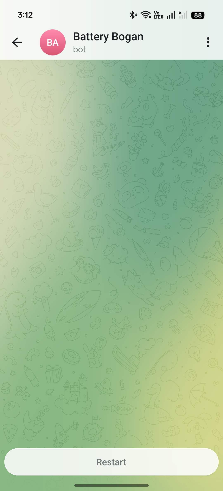
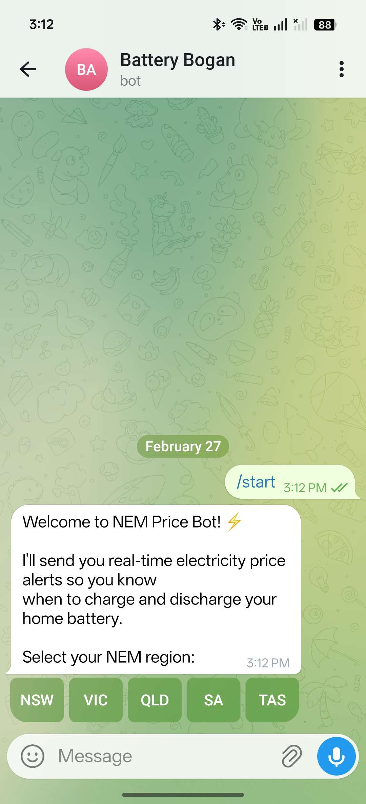
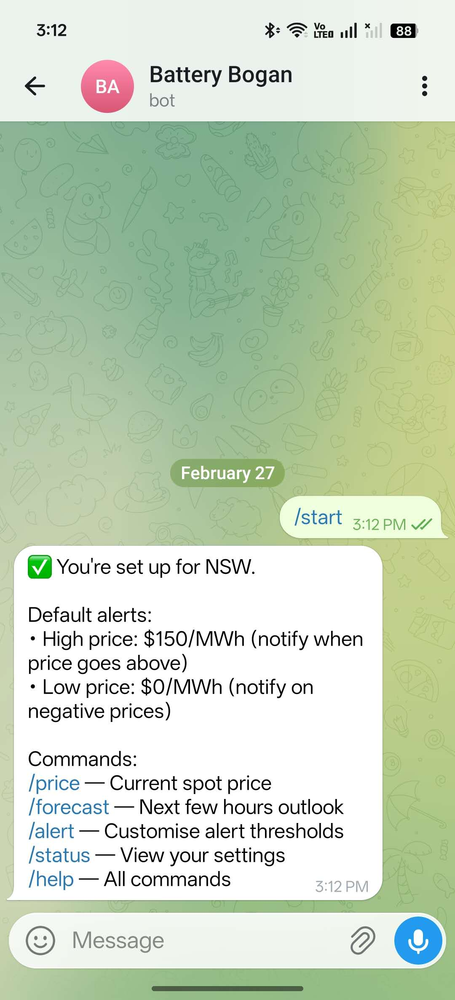
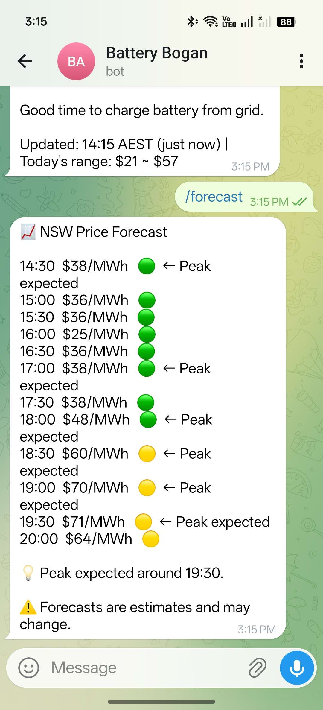
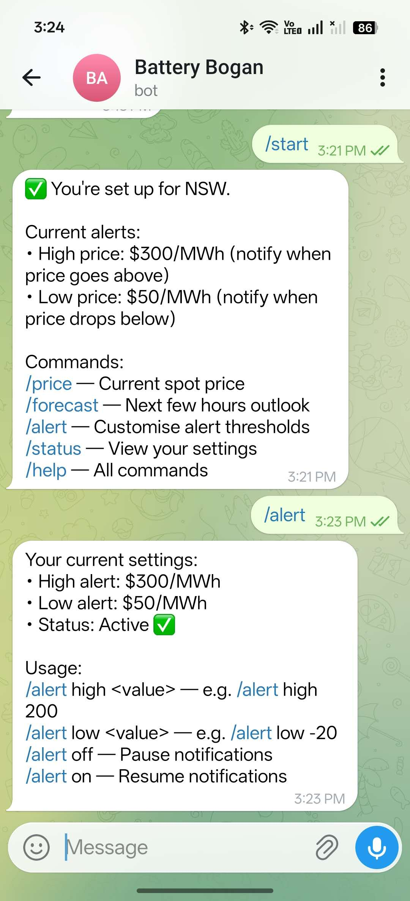
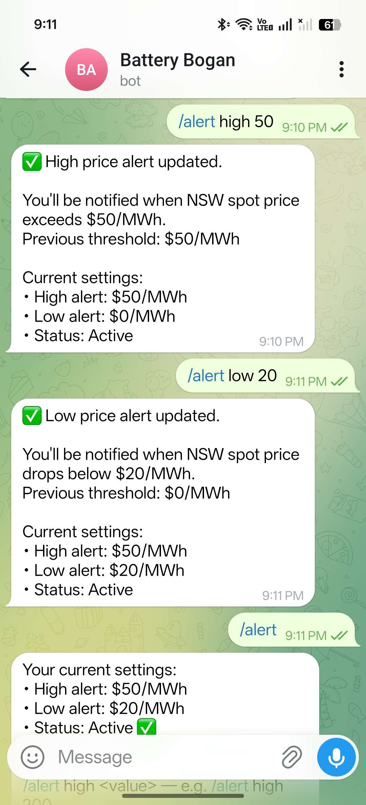

# NEM Price Bot

Telegram bot for Australian electricity price alerts. Monitors wholesale spot prices from AEMO and notifies you when to charge or discharge your home battery.

## How It Works

### 1. Find the bot on Telegram

Search for **Battery Bogan** in Telegram, or open [t.me/BatteryBoganBot](https://t.me/BatteryBoganBot) directly.

  

### 2. Start the bot and select your region

Send `/start` to the bot. Choose your NEM region from the inline buttons.

  
  
  

### 3. Check prices and forecasts

Use `/price` for the current 5-minute spot price with battery action advice. Use `/forecast` to see the next few hours and plan ahead.

  

### 4. Customise your alerts

Use `/alert` to view your settings, then `/alert high <value>` and `/alert low <value>` to set your thresholds. The bot will push notifications automatically when prices cross them.

  
  

## Commands

| Command | Description |
|---------|-------------|
| `/start` | Register and select NEM region (NSW/VIC/QLD/SA/TAS) |
| `/price` | Current spot price with action suggestion |
| `/forecast` | Price forecast for next 4-6 hours |
| `/alert high 200` | Set high price alert threshold |
| `/alert low -20` | Set low price alert threshold |
| `/alert off` / `on` | Pause / resume notifications |
| `/status` | View current settings |
| `/region` | Change NEM region |
| `/help` | All commands |

## Automatic Alerts

The bot pushes notifications automatically:

- **High price** -- spot price exceeds your threshold
- **Low/negative price** -- spot price drops below your threshold
- **Spike** -- price jumps >$100/MWh in 5 minutes
- **Forecast warning** -- high prices predicted within 1 hour
- **All clear** -- price returns to normal after a high-price event

## Price Levels

| $/MWh | Level | What to do |
|-------|-------|------------|
| < 0 | Negative | Charge from grid, run appliances |
| 0-50 | Low | Good time to charge battery |
| 50-100 | Normal | No action needed |
| 100-200 | Elevated | Consider using battery |
| 200-500 | High | Discharge battery |
| > 500 | Extreme | Discharge + export immediately |

## Data Source

Real-time prices from [AEMO](https://aemo.com.au) (Australian Energy Market Operator), updated every 5 minutes.

## License

MIT
